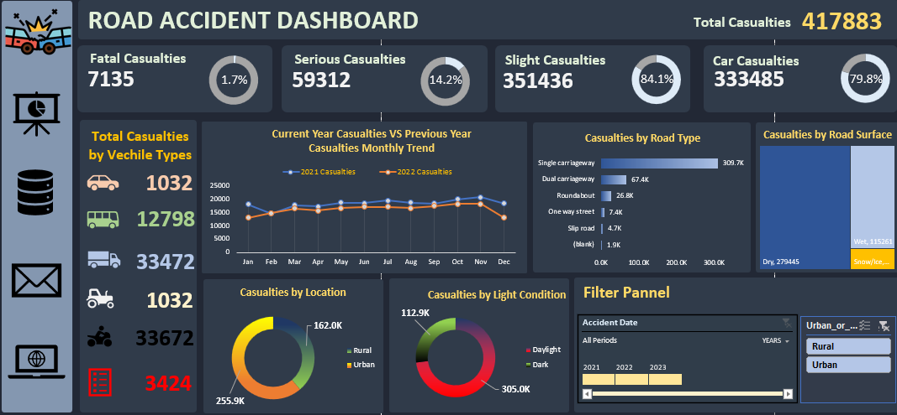

# 🚗 Excel Road Accident Dashboard

This project presents an interactive Excel dashboard built to analyze and visualize road accident data for data-driven insights. It is designed for quick decision-making and highlights critical accident metrics such as total fatalities, accident causes, vehicle types, locations, and trends over time.

## 📊 Excel Dashboard Preview

## 📊 Features

- Interactive Excel Dashboard using Pivot Tables & Slicers
- Year-wise and State-wise accident trends
- Key KPIs: Total Accidents, Fatalities, Injuries
- Accident cause breakdown and vehicle involvement analysis
- Clean, visually appealing charts and slicers for dynamic filtering

## 📁 Project Structure

## ⚙️ Tools Used

- **Microsoft Excel** (Pivot Tables, Slicers, Charts)
- **Data Cleaning**: Excel formulas & transformation techniques

## ✅ How to Use

1. Clone this repository or download the ZIP file.
2. Open `Accident_Dashboard.xlsx` in Microsoft Excel.
3. Use slicers to filter by year, state, vehicle type, etc.
4. Hover over charts for insights and use pivot tables for deep-dive analysis.

## 📌 Use Cases

- Government & policy agencies to monitor traffic safety
- Analysts tracking accident trends over time
- Educational or demo project to showcase Excel dashboarding skills

## 🧑‍💻 Author

**Richanshu Yadav**  
[GitHub Profile](https://github.com/richanshu14)
